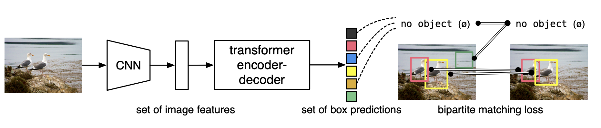

# DETR
**End-to-End Object Detection with Transformers paper, code review**

* Class : Advanced computer vision (AAA739, Professor Seungryong Kim)
* Date : 2022.3.10

* Paper : [End-to-End Object Detection with Transformers paper]() ( ECCV 2020, Facebook AI ) 

### 1. Paper Review

You can see my review slide : "DETR_paper_review.pdf"

### 2. Code Review

DETR code based on official implementation (https://github.com/facebookresearch/detr)

> * DETR repo provides a colab notebook to use model easily (minimal implementation version)
>
> * The original colab notebook describes the file as follows
>
> ​        : In this notebook we show a demo of DETR (Detection Transformer), with slight differences with the baseline model in the paper.We show how to define the model, load pretrained weights and visualize bounding box and class predictions.

##### Contents 

* DETR Overview
* DETR Code Review
* Prediction with COCO Dataset
* Difference between DETR and ViT 

### 3. Reference

* https://github.com/facebookresearch/detr

* https://github.com/huggingface/transformers/blob/198c335d219a5eb4d3f124fdd1ce1a9cd9f78a9b/src/transformers/models/detr/modeling_detr.py

* https://github.com/NielsRogge/Transformers-Tutorials

* http://dsba.korea.ac.kr/seminar/?mod=document&uid=1784

* https://huggingface.co/docs/transformers/model_doc/detr
